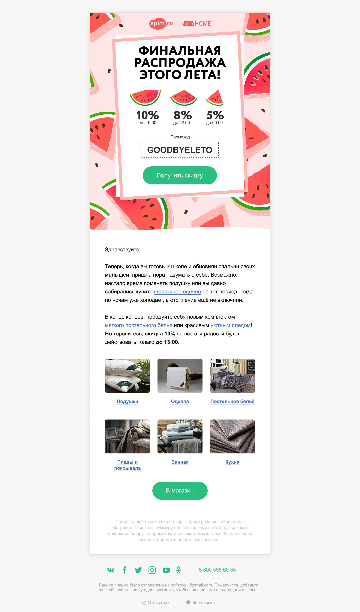

# HTML Email Template

Адаптивный шаблон для email-рассылок, протестированный в основных почтовых клиентах.

## Особенности
* **Адаптивность**: корректное отображение на мобильных устройствах.
* **Ширина**: оптимизировано под 600px.
* **Совместимость**: поддержка Outlook, Gmail и Apple Mail.

## Как использовать
1. Склонируйте репозиторий: `git clone <ссылка>`
2. Откройте `index.html` в браузере для просмотра.
3. Скопируйте код и используйте сервис для инлайнинга стилей (например, [Mailchimp Inliner](https://templates.mailchimp.com)).

## Превью

